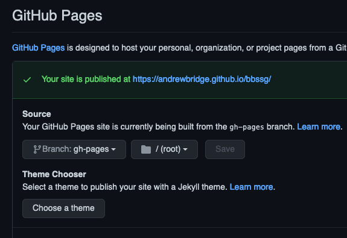

# Barebones Static Site Generator (BBSSG)

Sometimes you don't need a static site generator that comes with a templating language, MBs or even GBs of dependencies and a hundred lines of config.

BBSSG takes markdown content (no frontmatter here!) places it into an HTML template and performs some link matching. That's it!

It's built in [deno](https://deno.land/) so you don't need another `node_modules` folder filling up your hard drive and only adds ~100 lines of my shonky code to tie libraries together (written by much smarter, less shonky people).

[Live static site](https://andrewbridge.github.io/bbssg/)

## Install

Initialise a site with:

```sh
deno run --unstable --allow-read --allow-write https://deno.land/x/bbssg@v1.3.0/cli.ts initialise --gitignore --package --workflow
```

Yes, that `--unstable` looks scary, unfortunately, a majority of the [deno fs module](https://deno.land/std@0.89.0/fs) currently requires it.

Note the `--gitignore`, `--package` and `--workflow` flags:

- `--gitignore` adds the `./dist` directory to your `.gitignore` file
- `--package` adds the `build` script to generate a BBSSG site
- `--workflow` adds a `publish.yml` workflow to `.github/workflows` to provide publish-on-commit functionality

Additionally, if you **don't** want to initialise the source files, you can pass `--nosrc`.

### Manual

- Create `./src/template.html`
    - You can copy the contents of [`index.html`](./src/template.html) or...
    - Check the [Customising the template](#customising-the-template) section to put together your own template
- Create `./src/content/index.md`
- The `yarn build` or `npm run build` commands mentioned below are aliases of
    - `deno run --unstable --allow-read --allow-write https://deno.land/x/bbssg@v1.3.0/cli.ts generate`
- The site is generated in a `./dist` directory, so optionally add `/dist` to `.gitignore`
- The [`publish.yml`](./.github/workflows/publish.yml) can be copied in place into your site repo

### Customise

If any of the functionality or behaviour described below doesn't suit your needs, but you still want to use BBSSG, grab [`generate.ts`](./generate.ts) from this repo (or clone the whole thing) and tweak as necessary. You can then run it

## Usage

### Generate the site

- Add or change content in the `src/content` folder
- Run `yarn build` or `npm run build`

The default template is set up to use [Water.css](https://watercss.kognise.dev/), which does a good job of styling semantic HTML.

`index.md` will be used for the content on the `index.html` of your site. All other content files will be added as `index.html` files within a directory using the same file name as the file. For example

```
- src
    - content
        index.md
        about.md
        contact.md
```

...results in...

```
- dist
    index.html
    - about
        index.html
    - contact
        index.html
```

#### Serving from a non-root location

If your site is hosted from a non-root location (such as [andrewbridge.github.io/bbssg/](https://andrewbridge.github.io/bbssg/)), you can use the `--base` flag like `yarn build --base /bbssg` or `npm run build --base /bbssg`. You can also add this into your build command. Check the build command for this repository in [`package.json`](./package.json) for an example.

### Customising the template

The template, `src/template.html`, is the only other required file. Any global elements, such as a navbar, should go here. There's no automated generated of the navbar, it's all manual, but that provides you simple and complete control for the small price of this manual work.

Anything else found in the `src` directory will be copied verbatim to the generated site. Stylesheets or javascript you want to link to in the template will be in the same location on the final site. Make sure your references are all absolute or from the site's root. In this example, the `assets` directory is used for stylesheets for neatness, but it is not required.

The `` placeholder can be used once, anywhere in the template.

#### Page title

The page title will be inferred from the file name or the first H1 on the generated page. Currently the `` placeholder will only be replaced in the title element of the page.

#### Link matching

Any link on the generated page that matches the URL of the page being generated will had an "active" class added to it. It's up to you to handle any visual changes in your CSS.

## Publishing

Install the github workflow using the `initialise --workflow` parameter as described in the [Install](#install) section.

The workflow publishes the generated site to the `gh-pages` branch of your repo. To point GitHub Pages at your site, select `gh-pages` as your GitHub Pages branch in your repository settings.



This repository has the workflow running on any push to the `main` branch. The example site is served at [andrewbridge.github.io/bbssg](https://andrewbridge.github.io/bbssg/)

## Development

As this is a barebones generator, the development situation is pretty barebones too. Rather than setting up a built in file watcher, I use [watchexec](https://github.com/watchexec/watchexec) which is a fantastic general purpose file watcher. If you have this installed, run `yarn dev` or `npm run dev` to run the build every time a non `dist` file changes.

If you need to serve the site, `yarn serve` or `npm run serve` will run a simple HTTP server of the `dist` directory at [http://localhost:8000](http://localhost:8000).

There's no live reloading or hot reloading here, so be ready to hit that refresh button!

### Deployment

We rely on access to files from this repository during initialisation. Because of the remote nature of deno modules, we need to flatten files into a JS module in order to do so. When a non-js file has changed, run `yarn updateTemplate` to update the file module used during initialisation.

We host BBSSG from [deno.land](https://deno.land/x/bbssg@v1.3.0), which needs a new tag in the repository in order to update the package. For the same reason, each time we need to push to deno.land, we need to bump the version number used in this `README.md` and in `package.json` in order to keep everything aligned.